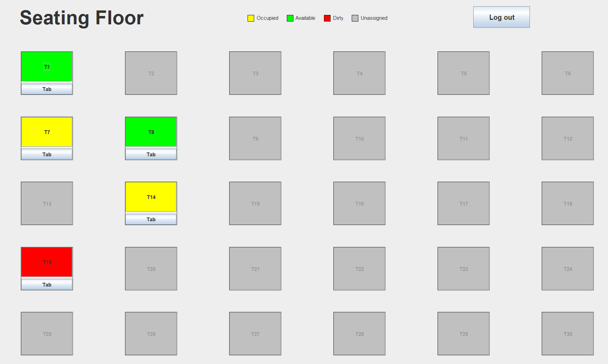
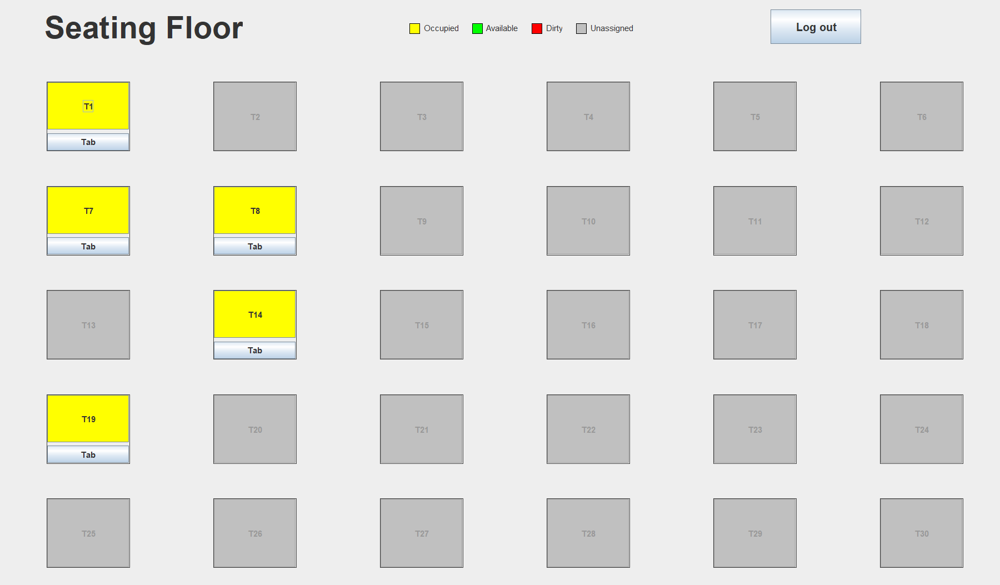
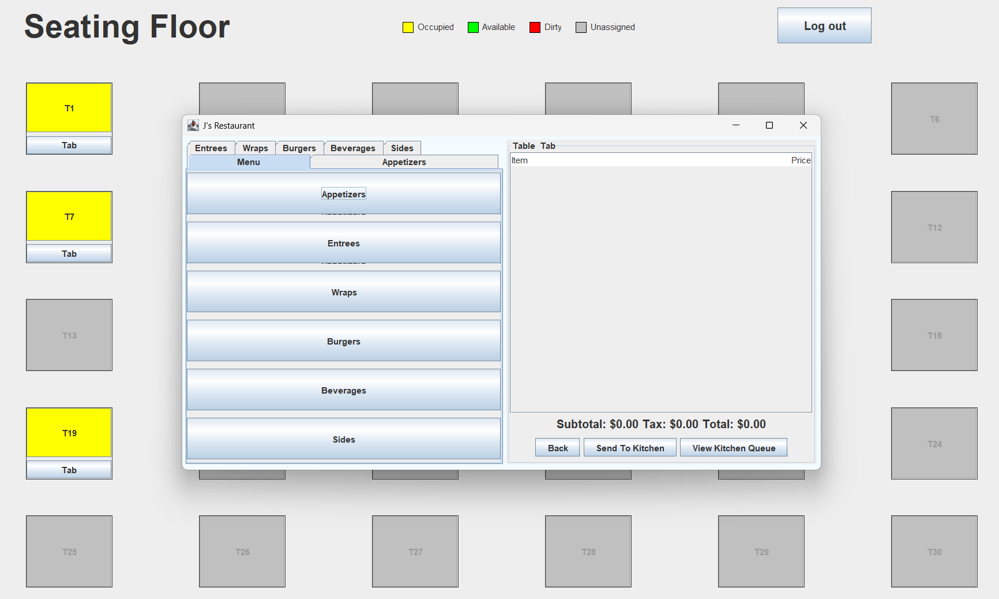
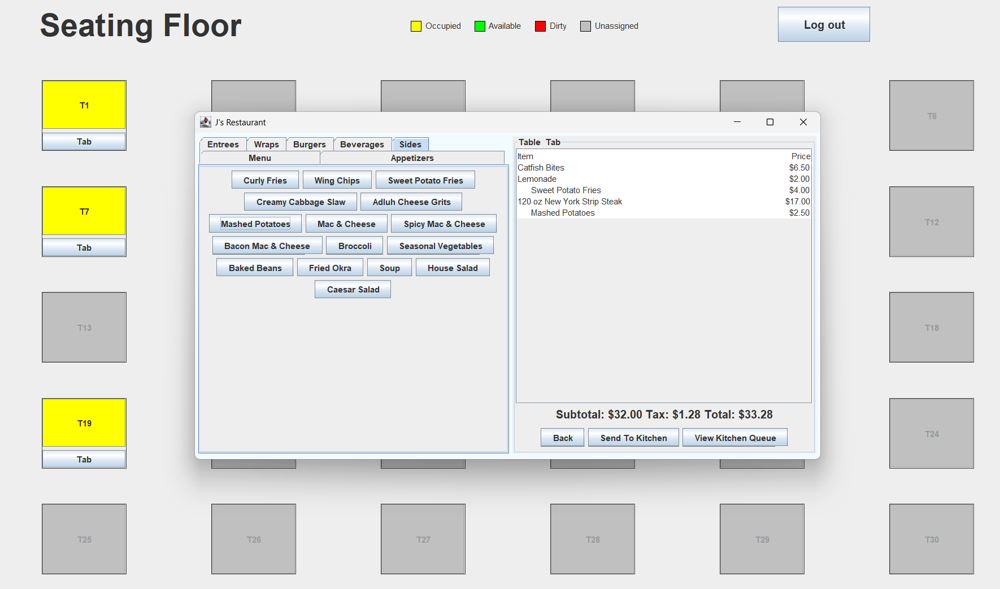
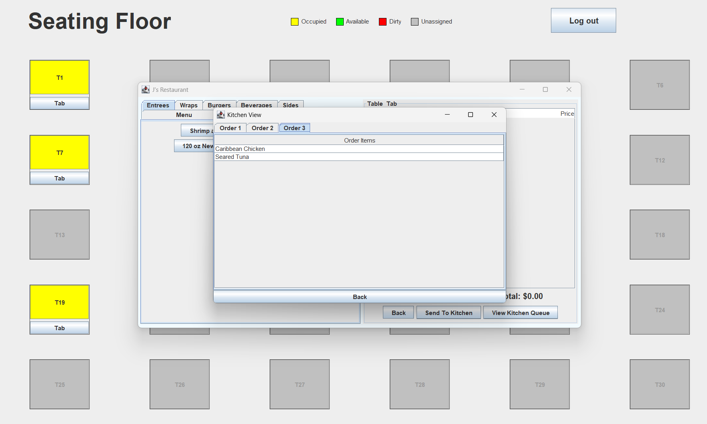

# Restaurant Management Software System

**A Java Swing desktop application for restaurant staff to manage tables, place orders, and send them to the kitchen, built by a team of five as a semester-long software engineering course project.**



## What This Is

J's Restaurant Management System is a role-based desktop application designed for waitstaff to manage their assigned tables and place customer orders end to end. After logging in, a waiter sees a live color-coded floor plan showing only the tables they are assigned to, with the rest being greyed out in the restaurant. From there they can open a table's tab, browse a categorized menu, build an order with automatic subtotal/tax/total calculation, and send it directly to the kitchen queue.

This project was developed collaboratively by a team of five across a full semester as the capstone deliverable for a Software Engineering course at Kennesaw State University. I served as the project lead, responsible for coordinating development across the team, integrating individually developed components into a single working system, and managing the full software engineering lifecycle from requirements through delivery.

## Features

- **Role-based login** — each waiter logs in with their own credentials and sees only their assigned tables on the floor plan.
- **Color-coded seating floor** — 30 tables displayed in a grid, color-coded by status: yellow (occupied), green (available), red (dirty), grey (unassigned).
- **Table cycling** — clicking an assigned table cycles it through status colors to reflect real-time floor changes.
- **Tabbed menu ordering** — a split-pane ordering window with a tabbed menu (Entrees, Wraps, Burgers, Beverages, Sides) on the left and a live order tab on the right.
- **Sides indentation** — side items are visually indented in the tab to distinguish them from main items.
- **Live tab with automatic pricing** — subtotal, 4% tax, and total update in real time as items are added; clicking a row removes it from the tab.
- **Send to kitchen** — completed orders are dispatched to a shared kitchen queue; the app validates the tab isn't empty before sending.
- **Kitchen queue view** — a separate Kitchen View window shows all pending orders as tabs, each listing the items sent for that order.

## Screenshots

| Seating Floor | Menu Navigation |
|---|---|
|  |  |

| Building an Order | Kitchen Queue |
|---|---|
|  |  |

## How to Run

**Requirements:** Java 11 or later

**Option 1 — Pre-built JAR (recommended):**

Download `SwingApp.jar` from the [latest release](https://github.com/Chris83848/Restaurant-Management-Software-System/releases/latest) and run:
```bash
java -jar SwingApp.jar
```

**Option 2 — Build from source:**
```bash
javac -d out src/*.java
java -cp out Main
```

**Demo login credentials** (waiter accounts):

| Username | Password | Assigned Tables |
|---|---|---|
| `SarahT99` | `password1` | T1, T7, T8, T14, T19 |
| `nicholasRoberts87` | `password2` | T3, T9, T11, T15, T22 |
| `emmaJ23!` | `password3` | T13, T16, T18, T24, T28 |

Each account shows only its assigned tables as active on the floor plan; all other tables appear greyed out.

## Repository Structure

```
Restaurant-Management-Software-System/
├── src/
│   ├── Main.java                    # Entry point
│   ├── LoginScreen.java             # Authentication and table assignment
│   ├── SeatingArrangement.java      # Floor plan view
│   ├── TablePanel.java              # Individual table component
│   ├── TopPanel.java                # Header with legend and logout
│   ├── NewMenu.java                 # Order entry window (menu + tab)
│   ├── MenuPanel.java               # Menu category navigation
│   ├── AppetizersPanel.java         # Appetizer menu items
│   ├── EntreePanel.java             # Entree menu items
│   ├── WrapsPanel.java              # Wraps menu items
│   ├── BurgersPanel.java            # Burgers menu items
│   ├── BeveragesPanel.java          # Beverages menu items
│   ├── SidesPanel.java              # Sides menu items
│   ├── Menu.java                    # Alternative menu component
│   ├── TableTab.java                # Tab/order display component
│   ├── KitchenPanel.java            # Kitchen queue view
│   ├── Orders.java                  # Order data model
│   └── OrdersQueue.java             # Shared static order queue
├── assets/                          # Screenshots for this README
├── docs/
│   ├── Requirements_Document.pdf    # Full functional and non-functional requirements
│   └── System_Design_Document.pdf   # System design, class diagrams, and DB schema
└── README.md
```

## Course Documentation

This project was built within a full software engineering process. The `/docs` folder contains the original course deliverables:

- **Requirements Document** — 20 functional requirements and 19 non-functional requirements covering all planned staff roles (waiter, host, busboy, chef, manager), plus use case diagrams, class diagrams, ER diagram, and state transition diagrams.
- **System Design Document** — conceptual system design, detailed class diagrams, database table descriptions, and technical support specification.

These documents reflect the full scope of the originally designed system. The implemented application focuses on the core waiter-facing workflow.

## Author

**Christopher Harris** — Project Lead · [GitHub](https://github.com/Chris83848) · [LinkedIn](https://www.linkedin.com/in/christopher-harris9/)
